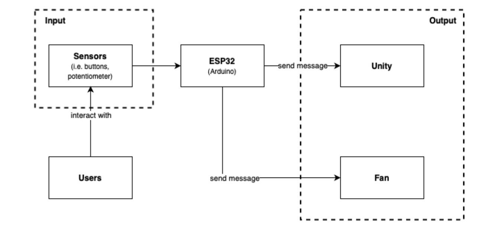
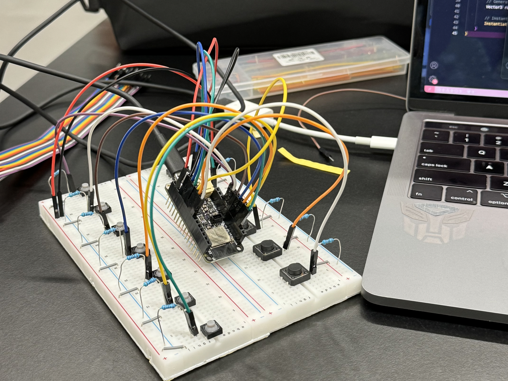
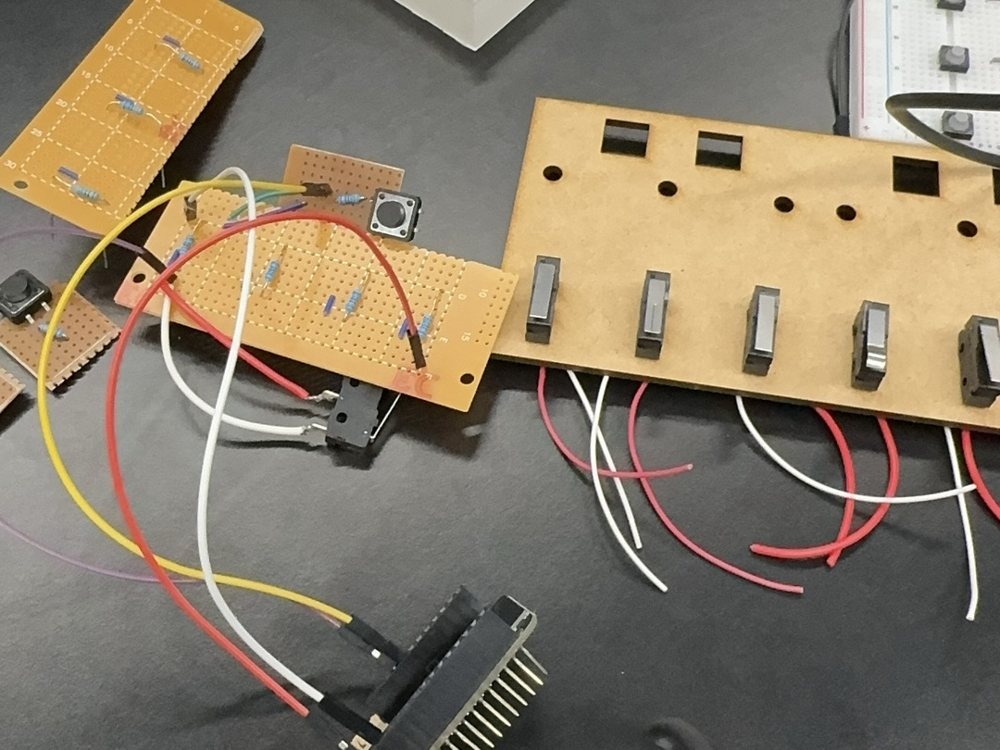
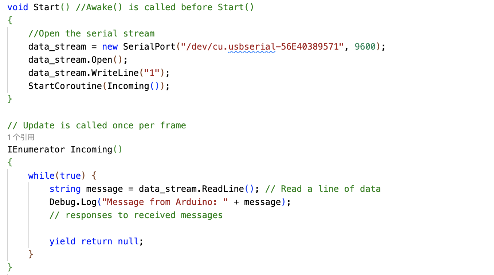
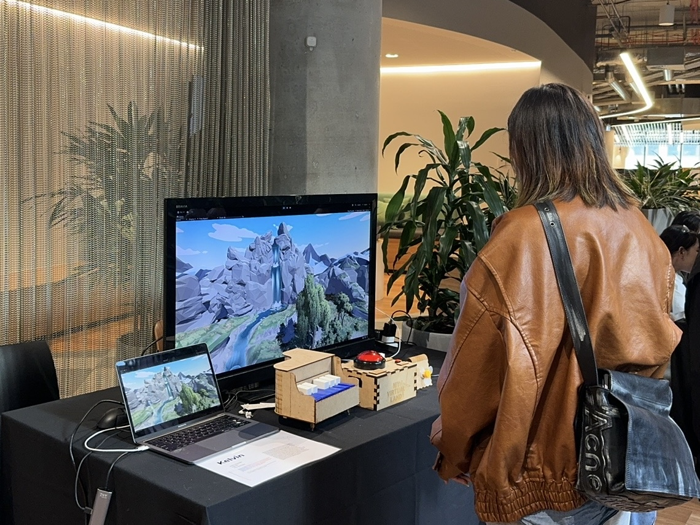

# My Virtual Land
**INFO90003 Designing Novel Interactions, The University of Melbourne**

## Table of contents
- [Overview](#overview)
- [System Design](#system-design)
- [Implementation](#implementation)
- [Demo](#demo)
- [Discussion](#discussion)
- [Full Report](INFO90003_Assignment2_MyVirtualLand_Kelvin.pdf)

## Overview
Stress and anxiety have been shown to be greatly reduced by immersive, interactive experiences. "My Virtual Land" is an interactive device designed to enhance relaxation and mindfulness by incorporating visual and auditory feedback. The system features an interactive piano interface paired with a dynamic virtual environment displayed on a monitor, creating a soothing and engaging user experience. Using an ESP32 microcontroller, the device processes real-time user inputs from sensors, enabling personalized interaction with the virtual scene rendered in Unity. User feedback has indicated high satisfaction with the system’s interactivity and calming effects, demonstrating its potential for anxiety relief. 

  
   
  <strong>Figure 1. Final Product in Showcase</strong>

## System Design
The system is designed to interface user inputs with various outputs using an ESP32. The design comprises three main components: Input, Processing, and Output.

  
   
  <strong>Figure 2. Illustration of Input and Output</strong>

### Input
Users interact with the product through sensors. These sensors capture user actions and convert them into electrical signals, which can be processed and received by the ESP32 microcontroller.
### Processing
The ESP32 (Arduino) microcontroller serves as the central processing unit of the system. It receives messages from hardware sensors and processes them to unity to generate appropriate responses.
### Output
The processed signals are sent to two types of output:
- Unity: a game development platform, which is used to simulate the forest environment for this product.
- Fan: a hardware device that can be controlled by ESP32.

Hardware components are connected to the ESP32 microcontroller. They all have one terminal to GND, one to power, and another connected with the pins on ESP32.

  
   
  <strong>Figure 3. Illustration of Hardware Connection</strong>

## Implementation
### Hardware
The circuit was simulated using a breadboard. After confirming the correctness, the buttons used for piano were soldered to a circuit board to enhance the connection stability and reduce occupied space.

  
  
  
   
  
   
   
  <strong>Figure 4. Piano Keyboard Build Progress</strong>

### Software
ESP32 is programmed to receive incoming messages from sensors (i.e. buttons and potentiometer), and send messages to unity and fan. The ESP32 sends messages to the fan based on the sensor
inputs, and the fan can be turned on and off in response to the sensor data. The communication between ESP32 and unity is achieved via serial port connection. When the unity scene is active, it initiates a connection by calling new SerialPort (port_name, speed). Once the communication is successfully set up, unity will use ReadLine() to continuously listen to the incoming message sent from ESP32. This method will read messages line by line, ensuring that complete messages are received and processed.

  
   
  <strong>Figure 5. Communication Between ESP32 and Unity</strong>

Upon receiving a message, Unity processes it and executes corresponding actions within the scene. For example, when a white key on the piano is pressed, unity will generate a tree at a random position according to pre-scripted functions.

## Demo

  

[YouTube](https://youtu.be/OtpWD8sItxw?si=R6eQ3gljy-lVIFp3)

## Discussion
Despite the efficiency of our interactive device in presenting a natural visual-auditory-sensory experience, user feedback highlighted several areas for enhancement: 
- Sound Design: The current design uses the white keys for sound inputs, allowing automatic control of sound. All users suggested that it would be more interesting if the piano could emit its original sound. To balance the natural sound design with user preferences, future designs could include a switch between "natural sound" and "piano sound" modes, providing a different auditory experience.
- Scenario Design: The current scenario only allows users to plant trees and provides a single viewpoint. User feedback suggested that future designs could incorporate more natural elements and scene types, as well as allow the same scene to exhibit seasonal changes, thereby enhancing the overall experience. Additionally, users recommended the installation of pressure sensors under the keys. When pressed with varying intensity, these sensors could trigger changes in the scene, such as planting larger trees or increasing wind intensity. Furthermore, somatosensory elements, such as the fan, could be adjusted accordingly to enhance the immersive experience.
### Limitation
Due to lack of experience, improper soldering resulted in plenty of short circuits, causing system malfunction. This issue impacted the stability of the system and a significant amount of time was spent verifying the correctness of the circuitry.
### Future Direction
The algorithm for generating trees at random position should be improved to ensure a more natural distribution of trees. Meanwhile, the communication between ESP32 and unity should be advanced to ensure faster and stable data transmission. VR technology can also be integrated to enhance user experience.
